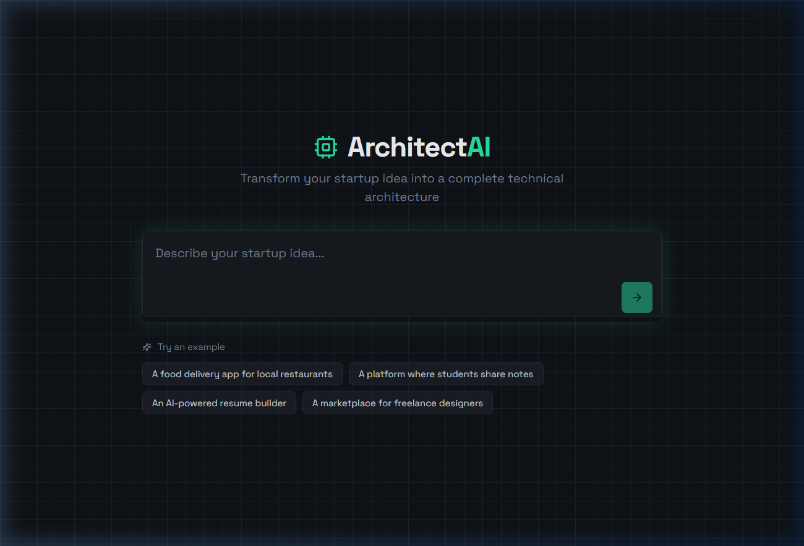

# 🏗️ Architect AI

[](https://nextjs.org/)
[](https://supabase.com/)
[](https://groq.com/)
[](https://opensource.org/licenses/MIT)

**Architect AI** is a state-of-the-art AI-powered platform that transforms your startup ideas into comprehensive technical blueprints. From tech stack selection to deployment guides, it handles the architecture so you can focus on building.

---

## 📸 Preview



> **Live Demo:** [Deploy to Vercel](https://vercel.com/new/clone?repository-url=https%3A%2F%2Fgithub.com%2Frishabharaj%2Fyour-architect-ai)

---

## 🔥 Features

- **💡 Idea Analysis**: Instant technical breakdown of any startup concept.
- **🛠️ Tech Stack Selection**: AI-guided decisions for Frontend, Backend, Database, and more.
- **💬 AI Architect Assistant**: Interactive chat to refine your architecture in real-time.
- **📄 Instant Export**: Download your complete blueprint as Markdown or PDF.
- **🔐 Secure Auth**: Google OAuth integration via Supabase.
- **🚀 State Persistence**: Never lose progress during sign-in redirects.

---

## 🛠️ Tech Stack

- **Core**: Next.js 14 (App Router), React 18, TypeScript
- **Styling**: Tailwind CSS, Framer Motion, Lucide React
- **UI Components**: shadcn/ui
- **Database & Auth**: Supabase
- **AI Backend**: Groq API (Llama 3.1 8B Instant)
- **State**: React Query + SessionStorage Persistence

---

## 🚀 Getting Started

### 1. Prerequisites
- Node.js 18+
- Supabase Account
- Groq API Key

### 2. Installation
```bash
# Clone the repository
git clone https://github.com/rishabharaj/your-architect-ai.git
cd your-architect-ai

# Install dependencies
npm install
```

### 3. Environment Setup
Create a `.env.local` file in the root directory:
```env
NEXT_PUBLIC_SUPABASE_URL=your_supabase_url
NEXT_PUBLIC_SUPABASE_ANON_KEY=your_supabase_anon_key
GEMINI_API_KEY=your_GEMINI_api_key
```

### 4. Database Setup
Run the SQL migration found in `supabase/migrations/20260316_full_schema.sql` in your Supabase SQL Editor to set up the `blueprints` and `chat_messages` tables.

### 5. Run it
```bash
npm run dev
```

---

## 📁 Project Structure

```
app/                    # Next.js App Router & API Routes
├── api/                # AI & Chat Endpoints
├── auth/               # OAuth Callback Handlers
src/
├── components/         # Modular React Components
├── hooks/              # Custom Hooks (useArchitect, useAuth)
├── lib/                # Export & Utility functions
├── integrations/       # Supabase Client
supabase/
└── migrations/         # SQL Database Schema
```

---

## 🧠 AI Reliability

By moving from client-side calls to a secure Next.js API route, we ensure:
- **Security**: Your `GROQ_API_KEY` remains hidden from the client.
- **Rate Limiting**: Intelligent pacing and request queuing.
- **Retries**: Built-in exponential backoff for stable AI responses.
- **JSON Mode**: Forced structured output for reliable UI rendering.

---

## ## License

Code is released under the MIT License – see the `LICENSE` file.

Personal media assets (all files under `images/` and `src/assets/` such as photos, certificates, and project screenshots) are NOT covered by the MIT license. Please replace them with your own when forking or deploying publicly. Keep attribution (link back or name credit) somewhere in the project if you reuse the code structure/design.

---

Made with ❤️ by [Rishabharaj Sharma](https://github.com/rishabharaj)
